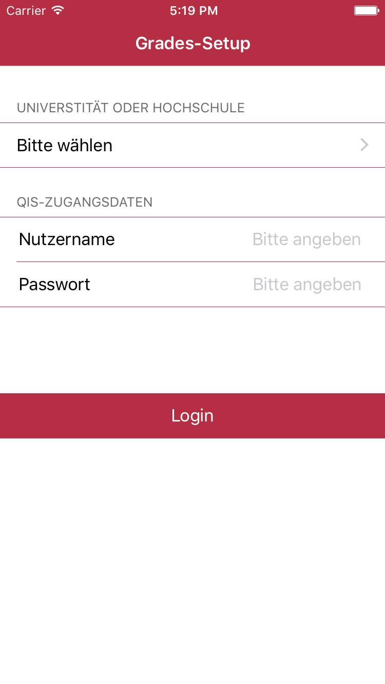
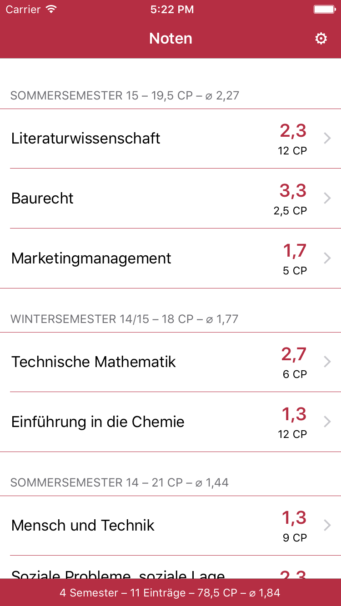
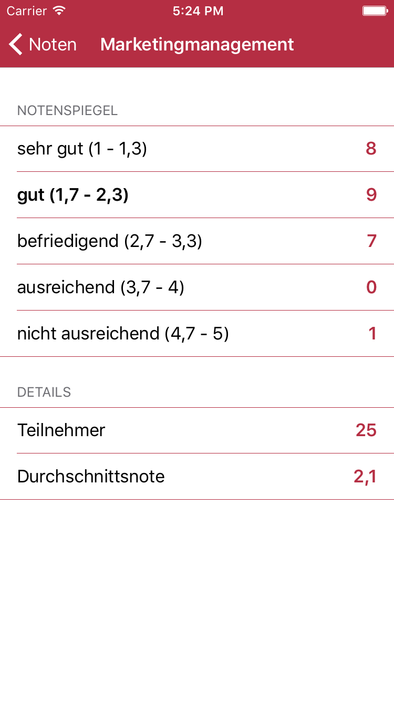

# Grades
Grades is a mobile app for iOS devices to fetch grades from universities' QIS websites. 

The app is downloadable for free in the [iTunes App Store](https://itunes.apple.com/de/app/grades/id1012050566).

# Requirements
* [Carthage](https://github.com/Carthage/Carthage)
    * [Alamofire](https://github.com/Alamofire/Alamofire)
    * [KeychainAccess](https://github.com/kishikawakatsumi/KeychainAccess)

# Screenshots

# Contribution
Fell free to contribute!  

# License
See [`LICENSE.txt`](LICENSE.txt) for more information.
